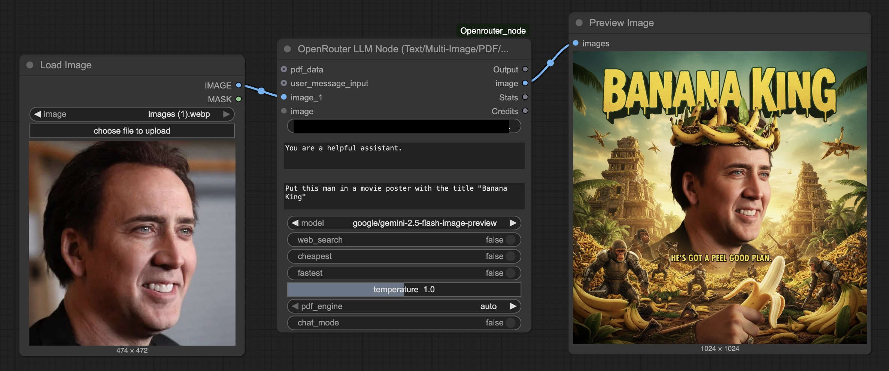

# ComfyUI OpenRouter Node

A custom node for ComfyUI that allows you to interact with OpenRouter's API, providing access to a wide range of models.  

Now Supporting Nano Banana




Multiple image inputs are supported. Make sure the model you are using supports multiple images to be sent at once. Thanks **@wTechArtist** for the idea!


## Updates

### 9/5/2025 - Added image support for nano-banana and future image models

### 6/12/2025 - Chat Mode
Added a new Chat Mode feature that lets you store context to enable conversations with LLMs. When you enable chat mode, the node remembers your conversation history and maintains context between messages. Your chats are automatically saved in timestamped folders, so you can pick up where you left off if you come back within an hour. After that, it'll start a fresh conversation. Each chat session is stored as a JSON file with a friendly name based on your first message. Just toggle "chat_mode" 

## Features

- Access to all models available on OpenRouter
- Support for multiple image inputs (up to 10 images) 
- **NEW: Image generation support** - Generate images with models like google/gemini-2.5-flash-image-preview (Nano-Banana)
- Dynamic image input visibility - additional inputs appear as you connect images
- PDF support with multiple OCR engine options
- Web search capability with `:online` modifier
- Cheapest provider routing with `:floor` modifier
- Fastest provider routing with `:nitro` modifier
- Detailed statistics on token usage and generation speed
- Real-time OpenRouter account balance display
- **Chat Mode** - Maintain conversation context across multiple messages with automatic session management

## Installation

1. Clone this repository into your ComfyUI custom_nodes folder:
```bash
cd ComfyUI/custom_nodes
git clone https://github.com/gabe-init/ComfyUI-Openrouter_node
```

2. Install the required dependencies:
```bash
pip install -r requirements.txt
```

3. Restart ComfyUI

## Usage

The OpenRouter node provides a simple interface to interact with various LLMs through the OpenRouter API.

### Inputs

#### Required Inputs:

- **api_key**: Your OpenRouter API key. You can get one from [OpenRouter](https://openrouter.ai/).
- **system_prompt**: The system prompt that sets the behavior of the LLM.
- **user_message_box**: The user message to send to the LLM.
- **model**: The model to use for generation. The node automatically fetches the list of available models from OpenRouter.
- **web_search**: Enable web search capability by appending `:online` to the model ID. This costs $4 per 1000 queries and automatically uses your openrouter balance.
- **cheapest**: Route to the cheapest provider by appending `:floor` to the model ID (enabled by default).
- **fastest**: Route to the fastest provider by appending `:nitro` to the model ID (disabled by default).
- **temperature**: Controls the randomness of the model's output (0.0 to 2.0).
- **chat_mode**: Enable conversation mode to maintain context across messages (disabled by default).

#### Optional Inputs:

- **image_1** through **image_10**: Multiple image inputs for multimodal models. The first image input (image_1) is always visible. Additional image inputs automatically appear as you connect images (up to 10 total).
- **pdf_data**: PDF document input for models that support document understanding.
- **pdf_engine**: Choose between "auto", "mistral-ocr", or "pdf-text" for PDF processing.
- **user_message_input**: Alternative input for the user message, useful for connecting to other nodes.

### Outputs:

- **Output**: The text response from the LLM.
- **image**: An image tensor if the response contains a generated image, otherwise returns an empty tensor.
- **Stats**: A string detailing tokens per second, input tokens, output tokens, temperature, and the model used.
- **Credits**: A string showing your remaining OpenRouter account balance (e.g., "Remaining: $9.792").

Note: To display the output text in ComfyUI, you can use the ShowText nodes from [ComfyUI-Custom-Scripts](https://github.com/pythongosssss/ComfyUI-Custom-Scripts), but any text display node will work.

## Examples

### Basic Text Generation

1. Add the OpenRouter node to your workflow
2. Enter your API key
3. Set a system prompt (e.g., "You are a helpful assistant.")
4. Enter a user message (e.g., "Explain quantum computing in simple terms.")
5. Select a model (e.g., "openai/gpt-4")
6. Run the workflow

### Image Understanding

1. Add the OpenRouter node to your workflow
2. Connect an image output from another node to the "image_1" input
3. Enter your API key
4. Set a system prompt (e.g., "You are a helpful assistant.")
5. Enter a user message (e.g., "Describe this image in detail.")
6. Select a multimodal model (e.g., "openai/gpt-4-vision" or "anthropic/claude-3-opus-20240229")
7. Run the workflow

### Multiple Image Analysis

1. Connect your first image to "image_1"
2. As soon as you connect it, "image_2" will automatically appear
3. Connect additional images as needed (up to 6 total)
4. Unused image inputs will automatically hide when disconnected
5. Enter a prompt that references multiple images (e.g., "Compare these images and describe the differences.")
6. Select a multimodal model that supports multiple images
7. Run the workflow

**Note**: The user is responsible for checking if their selected model supports multiple images. Most modern multimodal models (4o, Gemini Flash, etc.) support multiple images in a single request.

### Image Generation

1. Add the OpenRouter node to your workflow
2. Enter your API key
3. Set a system prompt (e.g., "You are a helpful assistant.")
4. Enter a user message with generation keywords (e.g., "Generate a beautiful sunset over mountains", "Create an image of a futuristic city", "Draw a cat wearing a hat")
5. Select an image-capable model (e.g., "google/gemini-2.5-flash-image-preview" - also known as Nano-Banana)
6. Run the workflow
7. The generated image will appear in the "image" output, which you can connect to preview nodes or other image processing nodes

**Note**: The node automatically detects image generation requests based on keywords like "generate", "create", "draw", "make", "produce", "design", "render", "image of", "picture of", "photo of". For image generation, use models that support image output modalities.

### Chat Mode

The Chat Mode feature allows you to maintain conversation context across multiple messages, enabling more natural and coherent conversations with the LLM.

#### How Chat Mode Works:

1. **Enable Chat Mode**: Toggle the "chat_mode" option to True
2. **Automatic Session Management**: 
   - Sessions are automatically created when you start a conversation
   - If you send another message within 1 hour, it continues the same session
   - After 1 hour of inactivity, a new session is created
3. **Session Storage**:
   - Conversations are stored in a `chats` folder within the node directory
   - Each session is saved with a timestamp and the first 5 words of your initial message
   - Format: `session_YYYYMMDD_HHMMSS_first_five_words`
4. **Context Preservation**: The entire conversation history is sent with each request, allowing the model to maintain context

#### Chat Mode Example:

1. Enable chat_mode in the node
2. First message: "Hello, my name is Alice"
3. Response: "Hello Alice! Nice to meet you. How can I help you today?"
4. Second message: "What's my name?"
5. Response: "Your name is Alice, as you mentioned earlier."

The conversation history is automatically managed and persisted between runs.

#### Managing Chat Sessions:

A utility script `manage_chats.py` is included to help you manage your chat sessions:

```bash
# List all chat sessions
python manage_chats.py list

# View a specific session
python manage_chats.py view session_20241206_143022_hello_how_are_you_today

# Export a session to different formats (json, txt, md)
python manage_chats.py export session_20241206_143022_hello_how_are_you_today -f md -o my_chat.md

# Clean up sessions older than 30 days
python manage_chats.py clean -d 30
```

### Routing Options

- For cost-effective responses, enable the "cheapest" option (on by default)
- For faster responses, disable "cheapest" and enable "fastest"
- For web search capability, enable "web_search"

## Troubleshooting

- **Model list not loading**: Check your internet connection and OpenRouter API key.
- **Error in response**: Check the error message in the output. It might be due to an invalid API key, model unavailability, or other API issues.
- **Slow responses**: Try using the `:nitro` modifier by enabling the "fastest" option.
- **Token counting issues**: The node uses tiktoken for accurate token counting, but falls back to an estimation method if there's an issue.

## License

MIT License

Copyright (c) 2024 

Permission is hereby granted, free of charge, to any person obtaining a copy
of this software and associated documentation files (the "Software"), to deal
in the Software without restriction, including without limitation the rights
to use, copy, modify, merge, publish, distribute, sublicense, and/or sell
copies of the Software, and to permit persons to whom the Software is
furnished to do so, subject to the following conditions:

The above copyright notice and this permission notice shall be included in all
copies or substantial portions of the Software.

THE SOFTWARE IS PROVIDED "AS IS", WITHOUT WARRANTY OF ANY KIND, EXPRESS OR
IMPLIED, INCLUDING BUT NOT LIMITED TO THE WARRANTIES OF MERCHANTABILITY,
FITNESS FOR A PARTICULAR PURPOSE AND NONINFRINGEMENT. IN NO EVENT SHALL THE
AUTHORS OR COPYRIGHT HOLDERS BE LIABLE FOR ANY CLAIM, DAMAGES OR OTHER
LIABILITY, WHETHER IN AN ACTION OF CONTRACT, TORT OR OTHERWISE, ARISING FROM,
OUT OF OR IN CONNECTION WITH THE SOFTWARE OR THE USE OR OTHER DEALINGS IN THE
SOFTWARE.

## Credits

- [OpenRouter](https://openrouter.ai/) 
- [ComfyUI](https://github.com/comfyanonymous/ComfyUI) 


